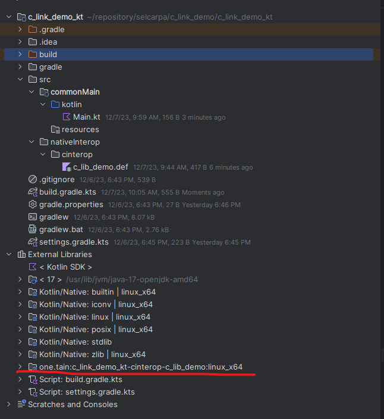
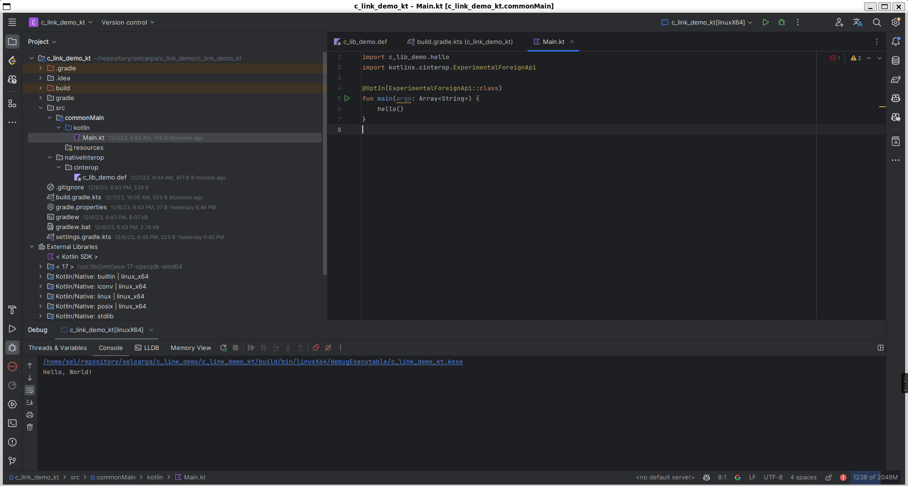

---
categories:
- docs
title: "Kotlin-Native Interop with C/C++"
date: 2023-12-06T17:38:08+08:00
authors: ["selcarpa"]
toc:
    enable: true
    auto: true
tags:
- kotlin
- kotlin-native
---

## Introduction

When developing with Kotlin-Native, many libraries are missing in the current version, so we need to supplement with C/C++. This article uses Linux as an example to demonstrate how to use C/C++ in Kotlin-Native.

## Prerequisites

- IntelliJ IDEA Community
- JDK 17
- CMake
- Linux

## References

[Interoperability with C](https://kotlinlang.org/docs/native-c-interop.html)

[Create an app using C Interop and libcurl – tutorial](https://kotlinlang.org/docs/native-app-with-c-and-libcurl.html)

## Project Repository

[selcarpa/c_link_demo](https://github.com/selcarpa/c_link_demo)

## Project Structure

```
└── c_link_demo
    ├── c_link_demo_c
    │   ├── CMakeLists.txt
    │   ├── library.c
    │   └── library.h
    └── c_link_demo_kt
        ├── build.gradle.kts
        ├── gradle
        │   └── wrapper
        │       ├── gradle-wrapper.jar
        │       └── gradle-wrapper.properties
        ├── gradle.properties
        ├── gradlew
        ├── gradlew.bat
        ├── settings.gradle.kts
        └── src
            ├── commonMain
            │   ├── kotlin
            │   │   └── Main.kt
            │   └── resources
            └── nativeInterop
                └── cinterop
                    └── c_lib_demo.def
```

## Steps

### Create the C/C++ Library

This example uses a C library.

#### Create the C Library

Create `library.c` and `library.h` in the `c_link_demo_c` directory. These files declare and implement a `hello` function.

library.h

```c
#ifndef C_LIB_DEMO_LIBRARY_H
#define C_LIB_DEMO_LIBRARY_H

void hello(void);

#endif //C_LIB_DEMO_LIBRARY_H
```

library.c

```c
#include "library.h"

#include <stdio.h>

void hello(void) {
    printf("Hello, World!\n");
}
```

Create `CMakeLists.txt` to compile the C library as a static library:

```cmake
cmake_minimum_required(VERSION 3.27)
project(c_link_demo_c C)

set(CMAKE_C_STANDARD 11)

add_library(c_link_demo_c STATIC library.c)
```

### Create the Kotlin-Native Project

Create a regular Kotlin (Gradle) project using IntelliJ IDEA, then modify `build.gradle.kts`:

```kotlin
import org.jetbrains.kotlin.gradle.plugin.mpp.KotlinNativeTarget

plugins {
    kotlin("multiplatform") version "1.9.21"
}

group = "one.tain"
version = "1.0-SNAPSHOT"

repositories {
    mavenCentral()
    google()
}

kotlin {
    fun KotlinNativeTarget.config() {
        binaries {
            executable {
                entryPoint = "main"
            }
        }
    }

    linuxX64("linuxX64") {
        config()
    }
}
```

After creating the project and building once, you'll notice IntelliJ doesn't recognize Kotlin files in the `main` directory. The default source and resource directories for native projects are `src/nativeMain/kotlin` and `src/nativeMain/resources`, so we need to adjust the project structure.

Create `src/commonMain/kotlin` in the project root, move Kotlin files from `main` to `commonMain`, create `src/commonMain/resources`, then delete the `main` directory.

You can now debug the Kotlin native application, though C interop is not yet set up.

### Create the C/C++ Interop Configuration File

Create `nativeInterop/cinterop/c_lib_demo.def` in the project root:

```properties
headers = /home/sel/repository/selcarpa/c_link_demo/c_link_demo_c/library.h
staticLibraries = libc_link_demo_c.a
libraryPaths = /home/sel/repository/selcarpa/c_link_demo/c_link_demo_c/cmake-build-debug
```

### Update the Build Script

Add the following inside the `linuxX64` block in `build.gradle.kts`:

```kotlin
compilations["main"].cinterops {
    @Suppress("LocalVariableName") val c_lib_demo by creating
}
```

Click Build. You'll see the `c_lib_demo` library loaded in IntelliJ's External Libraries.



### Call C Functions

Modify `Main.kt` in `commonMain`:

```kotlin
import c_lib_demo.hello
import kotlinx.cinterop.ExperimentalForeignApi

@OptIn(ExperimentalForeignApi::class)
fun main(args: Array<String>) {
    hello()
}
```

Output:



### Additional Notes

The `c_lib_demo.def` file supports other configuration methods:

```properties
headers = library.h
compilerOpts.linux = -I/home/sel/repository/selcarpa/c_link_demo/c_link_demo_c
linkerOpts.linux = -L/home/sel/repository/selcarpa/c_link_demo/c_link_demo_c/cmake-build-debug -lc_link_demo_c
```

This approach is more convenient for specifying platform-specific behavior.

> *This article is translated by deepseek-v4-flash (model: deepseek/deepseek-v4-flash).*
