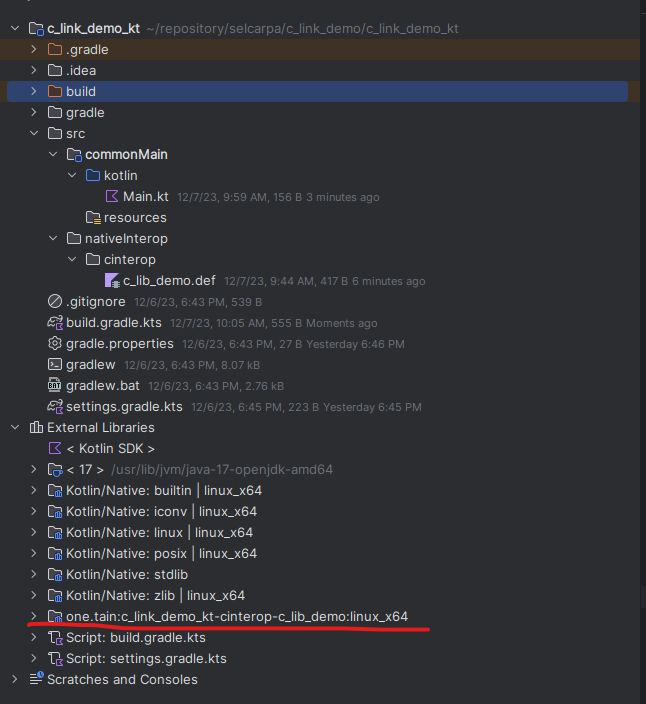
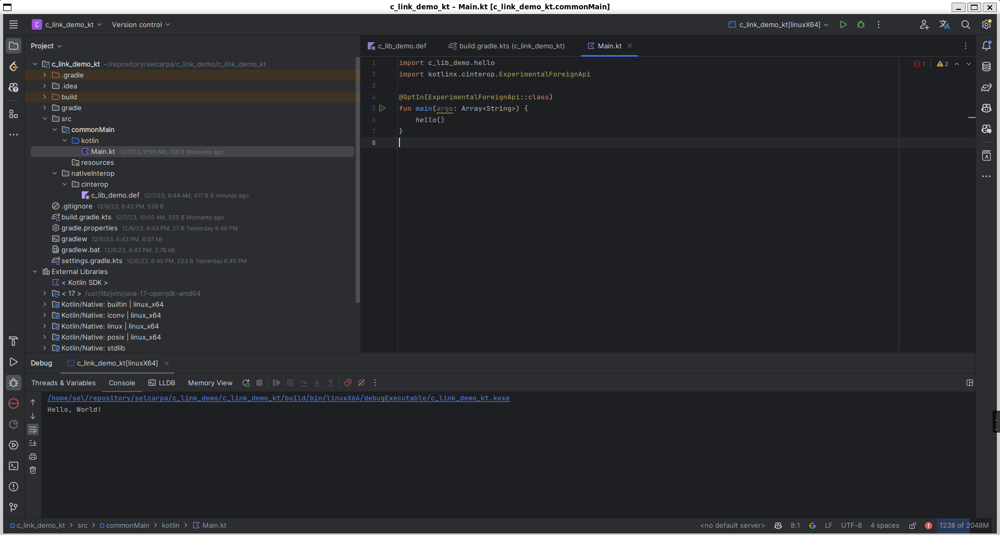

---
categories:
- docs
title: "kotlin-native与C/C++交互"
date: 2023-12-06T17:38:08+08:00
draft: true
tags:
- kotlin
- kotlin-native
---

# 介绍

在进行kotlin-native开发时，由于当前版本缺少很多库，所以我们需要使用C/C++进行补充。本文将以linux平台为例，介绍如何在kotlin-native中使用C/C++。

# 准备工作

- idea-community
- jdk17
- cmake
- linux


# 参考

[Interoperability with C](https://kotlinlang.org/docs/native-c-interop.html)

[Create an app using C Interop and libcurl – tutorial](https://kotlinlang.org/docs/native-app-with-c-and-libcurl.html)

# 项目地址

[selcarpa/c_link_demo](https://github.com/selcarpa/c_link_demo)

# 项目结构

```
└── c_link_demo
    ├── c_link_demo_c
    │   ├── CMakeLists.txt
    │   ├── library.c
    │   └── library.h
    └── c_link_demo_kt
        ├── build.gradle.kts
        ├── gradle
        │   └── wrapper
        │       ├── gradle-wrapper.jar
        │       └── gradle-wrapper.properties
        ├── gradle.properties
        ├── gradlew
        ├── gradlew.bat
        ├── settings.gradle.kts
        └── src
            ├── commonMain
            │   ├── kotlin
            │   │   └── Main.kt
            │   └── resources
            └── nativeInterop
                └── cinterop
                    └── c_lib_demo.def
```

# 步骤

## 创建C/C++库

此处以C库为例

### 创建C库

在c_link_demo_c目录下创建library.c和library.h文件，文件分别声明和实现一个hello函数。

library.h

```c
#ifndef C_LIB_DEMO_LIBRARY_H
#define C_LIB_DEMO_LIBRARY_H

void hello(void);

#endif //C_LIB_DEMO_LIBRARY_H
```

library.c

```c
#include "library.h"

#include <stdio.h>

void hello(void) {
    printf("Hello, World!\n");
}
```

创建CMakeLists.txt文件，作用是将C库编译成静态库，内容如下：

```cmake
cmake_minimum_required(VERSION 3.27)
project(c_link_demo_c C)

set(CMAKE_C_STANDARD 11)

add_library(c_link_demo_c STATIC library.c)
```

## 创建kotlin-native项目

使用idea创建普通的kotlin(gradle)项目，然后打开项目根目录下的build.gradle.kts文件，更改为以下内容：

```kotlin
import org.jetbrains.kotlin.gradle.plugin.mpp.KotlinNativeTarget

//使用kotlin-multiplatform插件，用以创建native项目
plugins {
    kotlin("multiplatform") version "1.9.21"
}

//包名版本号
group = "one.tain"
version = "1.0-SNAPSHOT"

repositories {
    mavenCentral()
    google()
}


//kotlin插件
kotlin {
    //指定main函数入口
    fun KotlinNativeTarget.config() {
        binaries {
            executable {
                entryPoint = "main"
            }
        }
    }

    //指定平台
    linuxX64("linuxX64") {
        config()
    }
}

```

可以关注到当前创建了一个kotlin-native的项目，进行一次构建后，会发现idea不会识别main目录下的kotlin文件，native项目的默认源码和资源目录是src/nativeMain/kotlin和src/nativeMain/resources，所以我们需要更改一下项目结构。

在项目根目录下创建src/commonMain/kotlin目录，将main目录下的kotlin文件移动到commonMain目录下，在commonMain目录下创建resources目录，删除main目录。

然后可以调试kotlin原生应用。但是此处并没有进行C的交互链接，后续的步骤会进行C交互的补充。

## 创建C/C++交互配置文件

在项目根目录下创建nativeInterop/cinterop/c_lib_demo.def文件，内容如下：

```properties
# 指定头文件的绝对路径
headers = /home/sel/repository/selcarpa/c_link_demo/c_link_demo_c/library.h
# 指定库文件的名称
staticLibraries = libc_link_demo_c.a
# 指定库文件的绝对路径
libraryPaths = /home/sel/repository/selcarpa/c_link_demo/c_link_demo_c/cmake-build-debug
```

## 更改构建脚本

在项目根目录下的build.gradle.kts文件中的linuxX64方法下，添加以下内容：

```kotlin
compilations["main"].cinterops {
            @Suppress("LocalVariableName") val c_lib_demo by creating
        }
```

点击构建按钮，在idea的External Libraries中可以看到c_lib_demo的库文件已经被加载进来了。


## 调用C函数

在commonMain目录下的main.kt文件中调用C函数，内容如下：

```kotlin
import c_lib_demo.hello
import kotlinx.cinterop.ExperimentalForeignApi

@OptIn(ExperimentalForeignApi::class)
fun main(args: Array<String>) {
    hello()
}
```

输出结果如下：





## 补充说明

c_lib_demo.def还有其他的配置方法，例：

```properties
# 指定头文件的名称
headers = library.h
# 指定编译的include行为，从而指定头文件的搜索路径
compilerOpts.linux = -I/home/sel/repository/selcarpa/c_link_demo/c_link_demo_c
# 指定链接的行为，从而指定库文件的搜索路径和库文件的名称
linkerOpts.linux = -L/home/sel/repository/selcarpa/c_link_demo/c_link_demo_c/cmake-build-debug -lc_link_demo_c
```

这种方式更方便地指定不同平台的行为