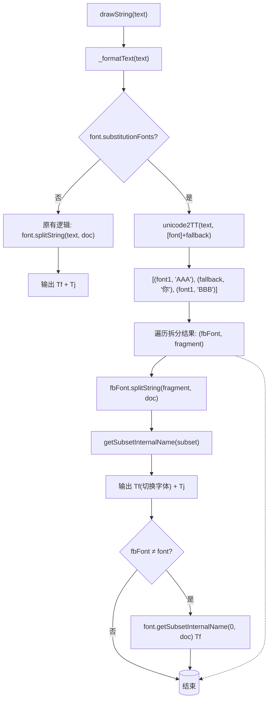

## 参考

- [如何使用reportlab的TTFont字体回退功能](/docs/reportlab-ttfont-fallback-usage/) — 配套使用指南
- [reportlab-enhanced 文档 - TrueType 字体回退](https://reportlab-enhanced.tain.one/zh/ch2a_fonts/#truetype)
- [reportlab-enhanced 文档](https://reportlab-enhanced.tain.one/)
- [selcarpa/reportlab_enhanced](https://github.com/selcarpa/reportlab_enhanced)

<!--more-->

## 介绍

[reportlab_enhanced](https://github.com/selcarpa/reportlab_enhanced) 是 [reportlab](https://www.reportlab.com/) 的 fork 分支，在上游基础上进行字体功能增强。TTFont 字体回退即为其中一项核心改进——当 TrueType 字体不包含某个字符的字形时，自动切换到替代字体渲染。

在原生 reportlab 中，TTFont 一直缺少字体回退机制（而上游的 Type1 字体支持 fallback）。这导致处理多语言混合文本（例如"Hello 你好 World"）时，如果主字体缺少某些字符的字形，显示效果会非常糟糕——轻则方块，重则缺失。

本文解析 reportlab_enhanced 为 TTFont 添加字体回退支持的实现思路与核心代码改动。如果需要了解如何使用这一功能，请参考[如何使用reportlab的TTFont字体回退功能](/docs/reportlab-ttfont-fallback-usage/)。

## 现状：reportlab 字体渲染流程

在 reportlab 中，文本渲染的核心路径分为三层：

1. **Canvas / TextObject** — 调用 `setFont()` 设置字体，`drawString()` / `drawText()` 发起绘制
2. **TextObject._formatText()** — 将文本转换为 PDF 内容流指令（`Tf` + `Tj`），根据字体类型分叉：
   - **Type1 / CID 字体**：走 `unicode2T1` 路径，依赖 `substitutionFonts` 做 fallback
   - **TTFont**：`splitString()` 子集编码，动态字体子集管理
3. **rl_accel** — 底层宽度计算和文本拆分函数，有 C 加速和纯 Python 两套实现

TTFont 的 fallback 改动涉及的就是这三条路径：

- **`textobject.py`** 的 `_formatText()`：TTFont 分支原来只调用 `splitString()`，现在增加了 fallback 拆分与字体切换逻辑
- **`rl_accel.py`** 的 `unicode2TT` + `instanceStringWidthTTF`：为 TTFont 补充了与 `unicode2T1` 平行的字形拆分和宽度计算能力
- **`graphics/` 下各渲染后端**：`drawString()` 的 TTFont 分支增加了相同的 fallback 拆分

### 原有流程（无 fallback）


### 改动后流程（启用 fallback）



关键差异：不再使用单一固定字体输出全部文本，而是先按字形可用性拆分文本，再为每个片段选择实际包含该字形的字体，分别走 `splitString()` 生成子集，最后通过 `getSubsetInternalName` 获取不同字体的 PDF 内部名称，组装到同一个 PDF 内容流中。循环结束后，若曾切换到 fallback 字体，会额外输出一次主字体的 `Tf` 指令，确保 PDF 中主字体的子集 0 存在。

## 架构决策

1. **环境变量 + property 为唯一控制点** — 下游代码只感知 `substitutionFonts` 属性，无需关心开关状态
2. **新增 `unicode2TT` 而非修改 `unicode2T1`** — 两类字体的字形检测机制不同（编码尝试 vs `charToGlyph` 查找），独立实现避免回归
3. **两步渲染流程** — `unicode2TT` 按字形拆分 → 各片段独立走 `splitString` 子集编码，职责分离
4. **HarfBuzz 降级** — shaped 文本遇到 fallback 时打印 warning 并走普通路径
5. **默认关闭** — 必须设置 `REPORTLAB_FONT_FALLBACK=1` 才启用，零侵入

### `REPORTLAB_FONT_FALLBACK` 设计说明

环境变量 `REPORTLAB_FONT_FALLBACK` 是整个 fallback 功能的总开关，控制点位于 `TTFont.substitutionFonts` 属性（`ttfonts.py`）：

- 默认值（非 `1`）：`substitutionFonts` 返回空列表 `[]`，所有渲染路径直接走原有逻辑，不产生任何开销
- `REPORTLAB_FONT_FALLBACK=1`：属性返回用户设置的 fallback 字体列表，各渲染模块（`textobject.py`、`graphics/utils.py`、`renderPM.py`、`renderPS.py`）通过 `if font.substitutionFonts:` 判断并启用 fallback 拆分

这种设计使开关逻辑集中在一处，下游渲染代码无需感知开关状态，只判断 `substitutionFonts` 是否非空即可。字体的 fallback 列表仍然由用户在注册字体时通过 `substitutionFonts` setter 或 `registerFontWithFallback` 设置。

## 核心实现

### 1. 控制开关：环境变量 + property

整个 fallback 机制由环境变量 `REPORTLAB_FONT_FALLBACK` 控制，默认关闭。需要时才启用。

```python
# ttfonts.py
@property
def substitutionFonts(self):
    if os.environ.get('REPORTLAB_FONT_FALLBACK', '0') != '1':
        return []
    return self._substitutionFonts

@substitutionFonts.setter
def substitutionFonts(self, value):
    self._substitutionFonts = value

def hasGlyph(self, char_or_code):
    if isinstance(char_or_code, str):
        code = ord(char_or_code)
    else:
        code = char_or_code
    if code == 0xa0:
        code = 0x20
    return code in self.face.charToGlyph
```

这个设计的精妙之处在于：下游代码只需 `if font.substitutionFonts:` 即可判断是否启用，无需关心开关状态。所有渲染逻辑（`textobject.py`、`graphics/utils.py` 等）都遵循这一约定。同时新增的 `hasGlyph()` 方法用于手动查询某个 Unicode 码点是否在字体的字形表中。

### 2. 字形拆分：`unicode2TT` 函数

这是实现的核心。参考已有的 `unicode2T1`（用于 Type1 字体），为 TTFont 创建了平行的 `unicode2TT` 函数。实际调用时，`rl_accel.py` 优先尝试从 C 加速模块 `_rl_accel` 导入，若不存在则回退到纯 Python 实现 `_py_unicode2TT`。

```python
# rl_accel.py
if 'unicode2TT' in _py_funcs:
    def _py_unicode2TT(utext, fonts):
        '''return a list of (TTFont,str) pairs representing the unicode text,
        split by glyph availability across the font list'''
        if not utext:
            return []
        # Pre-build (font, charToGlyph) list for fast lookup
        fontC2G = [(f, f.face.charToGlyph) for f in fonts]
        mainFont = fonts[0]
        R = []
        curFont = None
        curChars = []
        for ch in utext:
            code = ord(ch)
            if code == 0xa0:
                code = 0x20
            # Find first font that has this glyph
            found = None
            for f, c2g in fontC2G:
                if code in c2g:
                    found = f
                    break
            if found is None:
                found = mainFont  # fall back to main font (.notdef)
            if found is curFont:
                curChars.append(ch)
            else:
                if curChars:
                    R.append((curFont, ''.join(curChars)))
                curFont = found
                curChars = [ch]
        if curChars:
            R.append((curFont, ''.join(curChars)))
        return R
    _py_funcs['unicode2TT'] = _py_unicode2TT
    unicode2TT = _py_unicode2TT
```

逻辑：遍历每个字符，在字体列表中找到第一个包含该字形的字体（`charToGlyph` 查找），将连续使用同一字体的字符归并成一个片段，返回 `(字体, 文本片段)` 列表。若所有字体都不包含该字形，回退到主字体自身，最终由 PDF 阅读器渲染为 `.notdef` glyph。

### 3. PDF 渲染：`textobject.py` 中的字体切换

`_formatText` 方法中的 TTFont 分支新增了 fallback 处理。其中 `R = self._code.append` 用于将 PDF 指令追加到输出列表：

```python
# textobject.py
# TTFont with possible fallback or shaped text with fallback
if isinstance(text, ShapedStr) and font.substitutionFonts:
    import warnings
    warnings.warn('TTFont fallback does not support ShapedStr; degrading to non-shaped rendering')
    text = str(text)
if font.substitutionFonts:
    from reportlab.lib.rl_accel import unicode2TT as _unicode2TT
    curFontObj = font
    for fbFont, fbText in _unicode2TT(text, [font]+font.substitutionFonts):
        for subset, t in fbFont.splitString(fbText, canv._doc):
            if fbFont is not curFontObj or subset!=self._curSubset:
                if not tmpl:
                    tmpl = f'{fp_str(self._fontsize)} Tf {fp_str(self._leading)} TL'
                R(f'{fbFont.getSubsetInternalName(subset, canv._doc)} {tmpl}')
                self._curSubset = subset
                curFontObj = fbFont
            R(f'({canv_escape(t)}) Tj')
    # Restore main font if we switched
    if curFontObj is not font:
        for subset, t in font.splitString('', canv._doc):
            pass  # ensure subset exists
        if not tmpl:
            tmpl = f'{fp_str(self._fontsize)} Tf {fp_str(self._leading)} TL'
        R(f'{font.getSubsetInternalName(0, canv._doc)} {tmpl}')
        self._curSubset = 0
```

关键点：使用 `fbFont.getSubsetInternalName(subset, canv._doc)` 动态获取不同字体的 PDF 内部名称，而非使用固定的主字体名称。若曾切换到 fallback 字体，循环结束后还会输出一次主字体的 `Tf` 指令，确保 PDF 中主字体的子集 0 存在。

### 4. 宽度计算：`instanceStringWidthTTF`

字体回退后，`stringWidth()` 方法也需要能够正确计算混合字体的宽度：

```python
# rl_accel.py
if 'instanceStringWidthTTF' in _py_funcs:
    def _py_instanceStringWidthTTF(self, text, size, encoding='utf8'):
        "Calculate text width"
        if not isUnicode(text):
            text = text.decode(encoding or 'utf8')
        # Check for fallback fonts (property getter handles env var check)
        if getattr(self, 'substitutionFonts', None):
            return 0.001*size*sum((
                sum((fbFont.face.charWidths.get(ord(u), fbFont.face.defaultWidth) for u in fbText))
                for fbFont, fbText in _py_unicode2TT(text, [self]+self.substitutionFonts)
            ))
        g = self.face.charWidths.get
        dw = self.face.defaultWidth
        return 0.001*size*sum((g(ord(u),dw) for u in text))
    _py_funcs['instanceStringWidthTTF'] = _py_instanceStringWidthTTF
    instanceStringWidthTTF = _py_instanceStringWidthTTF
```

当启用了 fallback 时，先用 `unicode2TT` 拆分文本，再逐个字体计算宽度并求和。

### 5. 便利 API：`registerFontWithFallback`

为了降低使用门槛，添加了一个便利函数：

```python
# pdfmetrics.py
def registerFontWithFallback(name, filename, fallbackFonts=None, **kwargs):
    """Register a TTFont and set its substitutionFonts.

    fallbackFonts can be a list of font name strings (looked up via getFont)
    or TTFont instances (auto-registered).
    """
    from reportlab.pdfbase.ttfonts import TTFont
    font = TTFont(name, filename, **kwargs)
    registerFont(font)
    if fallbackFonts:
        resolved = []
        for fb in fallbackFonts:
            if isinstance(fb, str):
                resolved.append(getFont(fb))
            elif isinstance(fb, TTFont):
                if fb.fontName not in _fonts:
                    registerFont(fb)
                resolved.append(fb)
            else:
                raise ValueError(f'fallbackFonts elements must be str or TTFont, got {type(fb)}')
        font.substitutionFonts = resolved
    return font
```

支持传入字体名称字符串或 TTFont 实例，自动处理注册逻辑。

## 变更范围概览

本次改动涉及 **9个文件**，分为新增与修改两类：

### 新增内容

| 新增 | 说明 |
|------|------|
| `unicode2TT()` | 核心函数，按字形可用性将文本拆分为 `(TTFont, str)` 对 |
| `TTFont.hasGlyph()` | 检查字体是否包含指定字形 |
| `TTFont.substitutionFonts` property | 环境变量控制的 fallback 字体列表 |
| `pdfmetrics.registerFontWithFallback()` | 便利函数，一行注册字体并设置回退 |
| `rl_settings.defaultTTFFallbackFonts` | 全局默认 fallback 字体列表 |

### 修改内容

| 文件 | 变更 |
|------|------|
| `rl_accel.py` | 新增 `_py_unicode2TT`（`unicode2TT` Python 实现）和 `instanceStringWidthTTF` fallback 宽度计算；C 加速优先 |
| `ttfonts.py` | 新增 `substitutionFonts` property（含环境变量开关）和 `hasGlyph` 方法 |
| `textobject.py` | `_formatText` TTFont 分支增加 fallback 拆分与字体切换；ShapedStr 遇 fallback 时降级 |
| `graphics/utils.py` | freetype 和 `_renderPM` 两个后端增加 fallback 逻辑 |
| `graphics/renderPM.py` | `drawString` 的 TTFont 分支增加 fallback |
| `graphics/renderPS.py` | `_dynamicFont` 分支增加 fallback |

### 受影响模块一览

```
src/reportlab/lib/rl_accel.py          # 核心：unicode2TT、宽度计算
src/reportlab/pdfbase/ttfonts.py       # 核心：property、hasGlyph
src/reportlab/pdfgen/textobject.py     # 渲染：PDF 内容流字体切换
src/reportlab/graphics/utils.py         # 图形：text2PathDescription 两个后端
src/reportlab/graphics/renderPM.py     # 渲染：drawString 位图输出
src/reportlab/graphics/renderPS.py      # 渲染：PostScript 输出
src/reportlab/pdfbase/pdfmetrics.py     # API：registerFontWithFallback
src/reportlab/rl_settings.py           # 配置：defaultTTFFallbackFonts（C 加速模块 _rl_accel 不在源码中）
```

*本文由 AI 辅助编制*
