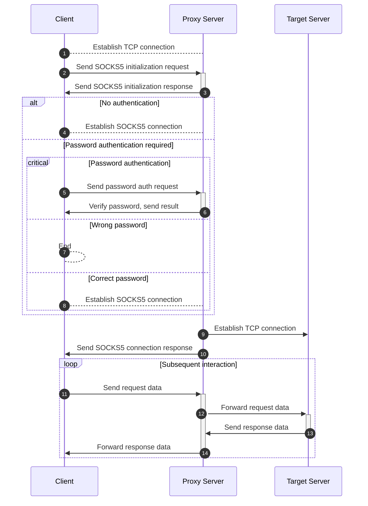

---
categories:
- docs
title: Implementing Trojan with Netty (Part 2)
date: 2023-08-25T09:49:07+08:00
tags:
- Netty
- java
- kotlin
- surfer
- trojan
- socks
draft: false
---

This section covers how to implement a SOCKS proxy server that allows TCP traffic. Most network-capable clients (curl, wget, browsers, etc.) can route requests through a proxy via environment variables or settings. Here's a simple example:

```shell
export https_proxy=socks5://127.0.0.1:1080
curl -v https://www.google.com
```

Before implementing the Trojan protocol, we first need to implement a SOCKS5 proxy server for use by clients.

This article follows Netty's official SOCKS5 implementation. Since most clients support both SOCKS4 and SOCKS5, we only implement SOCKS5 here. SOCKS5 supports TCP and UDP connections, but this article only covers TCP proxying.

## References

- [Netty/Netty socks example](https://github.com/Netty/Netty/tree/4.1/example/src/main/java/io/Netty/example/socksproxy)
- [SOCKS wiki](https://en.wikipedia.org/wiki/SOCKS)

## Sequence Diagram

The SOCKS5 TCP proxy sequence is roughly as follows:



## Implementation

### Channel Initialization

Channel initialization uses Netty's `SocksPortUnificationServerHandler`. This handler parses the initial request according to SOCKS4 or SOCKS5 protocol, producing a `SocksMessage` object. This corresponds to the "Establish TCP connection" and "Send SOCKS5 initialization request" steps in the sequence diagram. These decoders are built into Netty—this section focuses on combining them together with Netty bootstrapping.

#### Netty Bootstrap

```kotlin
ServerBootstrap().group(bossGroup, workerGroup)
    .channel(NioServerSocketChannel::class.java)
    .childHandler(ProxyChannelInitializer())
    .bind(inbound.port)
```

#### Channel Pipeline Initialization

```kotlin
class ProxyChannelInitializer : ChannelInitializer<NioSocketChannel>() {
    override fun initChannel(ch: NioSocketChannel) {
        initSocksInbound(ch, inbound)
        return
    }
    private fun initSocksInbound(ch: NioSocketChannel, inbound: Inbound) {
        ch.pipeline().addLast(SocksPortUnificationServerHandler())
    }
}
```

### SOCKS5 Authentication Message Handling

SOCKS5 authentication handling is customizable—Netty only provides the structural framework, leaving the actual authentication to the developer. We need to implement both no-auth and username/password authentication.

In the initialization phase, the TCP packet sent by the client has been converted to a `SocksMessage` object by `SocksPortUnificationServerHandler`. We create a `SimpleChannelInboundHandler` implementation parameterized with `SocksMessage` to handle SOCKS5 authentication requests.

After authentication is complete, the proxy transitions from the initialization/authentication phase to the command processing phase. At this point, we remove `SocksServerHandler` from the pipeline and add `SocksServerConnectHandler` for subsequent command handling (see comment 3 below).

Authentication proceeds in two steps. The first step receives the SOCKS5 initial packet:

|       | VER | NMETHODS | METHODS |
|-------|-----|----------|---------|
| Bytes | 1   | 1        | 1~255   |

- VER: SOCKS version, must be 5 (used for version checking in code comment 1)
- NMETHODS: Length of METHODS (handled automatically by `SocksPortUnificationServerHandler`)
- METHODS: Authentication methods supported, each byte 0~255. 0x00 = no auth, 0x02 = username/password auth

The server selects one method and notifies the client:

|       | VER | METHOD |
|-------|-----|--------|
| Bytes | 1   | 1      |

- VER: SOCKS version, must be 5
- METHOD: Selected method. Returns 0xFF if none match. We only implement 0x00 and 0x02 (see comment 2).

SOCKS5 Username/Password Authentication:
After negotiating username/password auth, the client sends credentials:

|       | VER | ULEN | UNAME | PLEN | PASSWD |
|-------|-----|------|-------|------|--------|
| Bytes | 1   | 1    | 1~255 | 1    | 1~255  |

- VER: Authentication protocol version, currently 0x01
- ULEN: Length of UNAME, 1 byte
- UNAME: Username
- PLEN: Length of PASSWD, 1 byte
- PASSWD: Password

Server response:

|       | VER | STATUS |
|-------|-----|--------|
| Bytes | 1   | 1      |

- VER: Authentication protocol version, currently 0x01
- STATUS: 0x00 = success, 0x01 = failure

```kotlin
class SocksServerHandler(private val inbound: Inbound) : SimpleChannelInboundHandler<SocksMessage>() {
    private var authed = false

    public override fun channelRead0(ctx: ChannelHandlerContext, socksRequest: SocksMessage) {
        when (socksRequest.version()!!) { // Comment 1: SOCKS version check
            SocksVersion.SOCKS5 -> socks5Connect(ctx, socksRequest)
            else -> { ctx.close() }
        }
    }

    private fun socks5Connect(ctx: ChannelHandlerContext, socksRequest: SocksMessage) {
        when (socksRequest) {
            is Socks5InitialRequest -> { socks5auth(ctx) }
            is Socks5PasswordAuthRequest -> { socks5DoAuth(socksRequest, ctx) }
            is Socks5CommandRequest -> {
                if (inbound.socks5Setting?.auth != null || !authed) { ctx.close() }
                if (socksRequest.type() === Socks5CommandType.CONNECT) {
                    // Comment 3: Remove SocksServerHandler, add SocksServerConnectHandler
                    ctx.pipeline().addLast(SocksServerConnectHandler(inbound))
                    ctx.pipeline().remove(this)
                    ctx.fireChannelRead(socksRequest)
                } else { ctx.close() }
            }
            else -> { ctx.close() }
        }
    }

    /**
     * Comment 2: Select auth method based on config
     */
    private fun socks5auth(ctx: ChannelHandlerContext) {
        if (inbound.socks5Setting?.auth != null) {
            ctx.pipeline().addFirst(Socks5PasswordAuthRequestDecoder())
            ctx.write(DefaultSocks5InitialResponse(Socks5AuthMethod.PASSWORD))
        } else {
            authed = true
            ctx.pipeline().addFirst(Socks5CommandRequestDecoder())
            ctx.write(DefaultSocks5InitialResponse(Socks5AuthMethod.NO_AUTH))
        }
    }

    private fun socks5DoAuth(socksRequest: Socks5PasswordAuthRequest, ctx: ChannelHandlerContext) {
        if (inbound.socks5Setting?.auth?.username != socksRequest.username()
            || inbound.socks5Setting?.auth?.password != socksRequest.password()
        ) {
            logger.warn("socks5 auth failed from: ${ctx.channel().remoteAddress()}")
            ctx.write(DefaultSocks5PasswordAuthResponse(Socks5PasswordAuthStatus.FAILURE))
            ctx.close()
            return
        }
        ctx.pipeline().addFirst(Socks5CommandRequestDecoder())
        ctx.write(DefaultSocks5PasswordAuthResponse(Socks5PasswordAuthStatus.SUCCESS))
        authed = true
    }
}
```

### SOCKS5 Command Message Handling

After authentication, the client sends a request message. The SOCKS5 request format:

|       | VER | CMD | RSV | ATYP | DST.ADDR | DST.PORT |
|-------|-----|-----|-----|------|----------|----------|
| Bytes | 1   | 1   | 1   | 1    | Variable | 2        |

- VER: SOCKS version, must be 5
- CMD: Command code, 1 byte. Three types:
  - 0x01: CONNECT
  - 0x02: BIND
  - 0x03: UDP ASSOCIATE
- RSV: Reserved, 0x00
- ATYP: Address type, 1 byte:
  - 0x01: IPv4
  - 0x03: Domain name
  - 0x04: IPv6
- DST.ADDR: Destination address (variable length)
- DST.PORT: Destination port, 2 bytes

Netty's `Socks5CommandRequest` object extracts CMD, ATYP, DST.ADDR, and DST.PORT, so we simply use those.

We only discuss CMD=0x01 (CONNECT). This command establishes a TCP connection. After receiving the command, the server connects to the target address and port, then returns a response:

|       | VER | REP | RSV | ATYP | BND.ADDR | BND.PORT |
|-------|-----|-----|-----|------|----------|----------|
| Bytes | 1   | 1   | 1   | 1    | Variable | 2        |

- VER: SOCKS version, must be 5
- REP: Reply code, 1 byte:
  - 0x00: Success
  - 0x01: General SOCKS server failure
  - 0x02: Connection not allowed by ruleset
  - 0x03: Network unreachable
  - 0x04: Host unreachable
  - 0x05: Connection refused
  - 0x06: TTL expired
  - 0x07: Command not supported
  - 0x08: Address type not supported
  - 0x09-0xFF: Other errors
- RSV: Reserved, 0x00
- ATYP: Address type (same as request)
- BND.ADDR: Bound address
- BND.PORT: Bound port

```kotlin
class SocksServerConnectHandler(private val inbound: Inbound) : SimpleChannelInboundHandler<SocksMessage>() {

    private fun socks5Command(originCTX: ChannelHandlerContext, message: Socks5CommandRequest) {
        resolveOutbound.ifPresent { outbound ->
            relayAndOutbound(
                RelayAndOutboundOp(
                    originCTX = originCTX,
                    outbound = outbound,
                    odor = odor
                ).also { relayAndOutboundOp ->
                    relayAndOutboundOp.connectEstablishedCallback = {
                        originCTX.channel().writeAndFlush(
                            DefaultSocks5CommandResponse(
                                Socks5CommandStatus.SUCCESS,
                                message.dstAddrType(),
                                message.dstAddr(),
                                message.dstPort()
                            )
                        ).addListener(ChannelFutureListener {
                            originCTX.pipeline().remove(this@SocksServerConnectHandler)
                        })
                    }
                }
            )
        }
    }
}
```

At this point, the code successfully handles SOCKS5 proxy messages and establishes a TCP connection to the target server. The next step is forwarding request data from the client to the target server and response data back.

### Data Forwarding (Relay Handler)

The relay handler forwards data received from one channel to another. The constructor takes the target channel as a parameter. When the handler receives data from the source channel, it writes directly to the target channel.

```kotlin
class RelayInboundHandler(
    private val relayChannel: Channel,
    private val inActiveCallBack: () -> Unit = {}
) : ChannelInboundHandlerAdapter() {
    override fun channelRead(ctx: ChannelHandlerContext, msg: Any) {
        if (relayChannel.isActive) {
            relayChannel.writeAndFlush(msg).addListener(ChannelFutureListener { })
        }
    }
}
```

## Summary

Implementing a SOCKS5 proxy requires parsing initialization, authentication, and command messages according to the SOCKS5 protocol specification. Based on the command content, establish a TCP connection to the target server, then forward data bidirectionally between the client and target server.

> *This article is translated by deepseek-v4-flash (model: deepseek/deepseek-v4-flash).*
