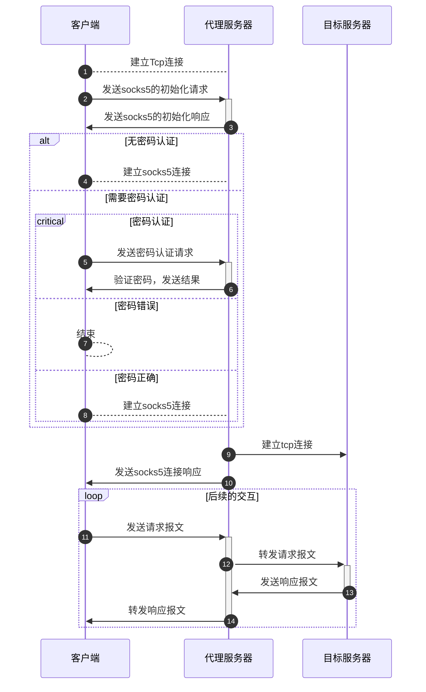

# 用netty实现Trojan（二）

本节主要是介绍如何实现一个允许tcp通过的socks代理服务器，大部分携带网络功能的客户端，如curl、wget、浏览器等，在请求的时候，可以通过环境变量或者设置的形式，使这些客户端通过代理进行请求，以下是一个简单的例子：

```shell
export https_proxy=socks5://127.0.0.1:1080 # 设置https使用socks5代理
curl -v https://www.google.com # 进行一次https的请求
```

在实现trojan协议之前，我们首先需要实现一个socks5代理服务端，用以在客户端中使用。

本文目前参照netty官方的socks5实现，实现了一个socks代理服务器，由于大部分客户端都已经同时兼容socks4和socks5，此处仅实现socks5协议，socks5协议支持tcp、udp连接方式，但此处只实现了socks5的tcp代理。

## 参考

- [netty/netty socks example](https://github.com/netty/netty/tree/4.1/example/src/main/java/io/netty/example/socksproxy)
- [socks wiki](https://zh.wikipedia.org/wiki/SOCKS)


## 时序图

socks5的tcp代理，大致时序如下：



## 实现

### 初始化通道

初始化通道采用netty的**SocksPortUnificationServerHandler**，在这个handler中，会将首个请求，按照socks4或者socks5的协议进行解析，解析结果**SocksMessage**对象。

#### 启动netty部分

```kotlin
ServerBootstrap().group(bossGroup, workerGroup)
    .channel(NioServerSocketChannel::class.java)
    .handler(LoggingHandler(LogLevel.TRACE, ByteBufFormat.SIMPLE))
    .childHandler(ProxyChannelInitializer())
    .option(ChannelOption.SO_BACKLOG, 65536)
    .option(ChannelOption.ALLOCATOR, UnpooledByteBufAllocator.DEFAULT)
    .childOption(ChannelOption.SO_KEEPALIVE, true)
    .bind(inbound.port)
```

#### 通道管线初始化

```kotlin
//...
class ProxyChannelInitializer : ChannelInitializer<NioSocketChannel>() {
    //...
    override fun initChannel(ch: NioSocketChannel) {
        //...
        if (inbound != null) {
            when (Protocol.valueOfOrNull(inbound.protocol)) {
                //...
                Protocol.SOCKS5 -> {
                    initSocksInbound(ch, inbound)
                    return
                }
                //...
            }
        }
        //...
    }
    private fun initSocksInbound(ch: NioSocketChannel, inbound: Inbound) {
        ch.pipeline().addLast(SocksPortUnificationServerHandler())
        ch.pipeline().addLast(SocksServerHandler(inbound))
    }
    //...
}


```