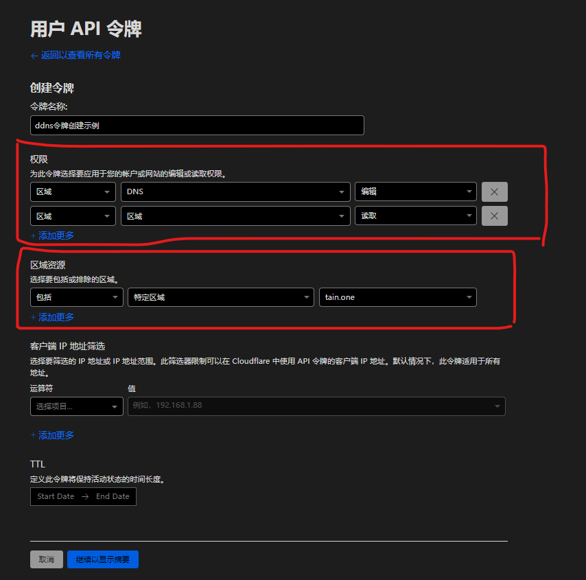
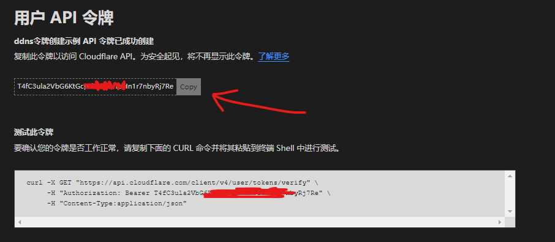
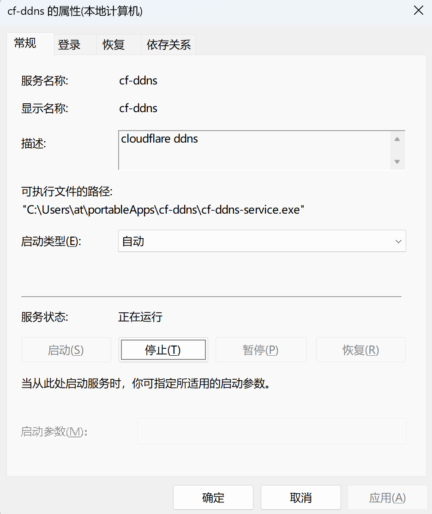

## Introduction

This article describes the simplest way to quickly get started with Cloudflare DDNS.

## Prerequisites

### 1. Register a Cloudflare Account

We won't go into detail here; please refer to other tutorials.

### 2. Get a Cloudflare API Token

1. Visit https://dash.cloudflare.com/profile/api-tokens
2. Click "Create Token" and select the "Edit zone DNS" template
3. Enter any name
4. Set permissions to edit zone DNS:
   - Zone - Zone - Read
   - Zone - DNS - Edit
5. For Zone Resources, select the domain for DDNS
6. Client IP Filter (optional) — leave blank since DDNS uses dynamic IPs
7. TTL — leave empty



After creation, copy the token.



### 3. Get Your Zone ID

1. Visit https://dash.cloudflare.com/
2. Select the domain for DDNS
3. Find the Zone ID in the bottom-right corner


## Quick Start

### Windows x64

#### Basic Usage

1. Download `cf-ddns-windows-x64-(version)-RELEASE.exe` from the [releases page](https://github.com/selcarpa/cloudflare-ddns/releases/latest) and rename it to `cf-ddns.exe`
2. Place it in a directory, e.g., `C:\Users\[UserName]\cf-ddns`
3. Open a terminal in that directory and run:
   ```shell
   cf-ddns.exe -gen -zoneId=<zoneId> -authKey=<token> -domain=<domain> -v4=<true/false> -v6=<true/false>
   ```
   This checks IP every 300 seconds and updates DNS on change.

#### With winsw (Windows Service)

The basic usage requires the terminal to stay open. Use [winsw](https://github.com/winsw/winsw) to wrap `cf-ddns.exe` as a Windows service.

1. Download `cf-ddns-windows-x64-(version)-RELEASE.exe`, rename to `cf-ddns.exe`
2. Place it in a directory like `C:\Users\[UserName]\cf-ddns`
3. Download [winsw-2.12.0-bin.exe](https://github.com/winsw/winsw/releases/tag/v2.12.0)
4. Create `cf-ddns-service.xml` in the same directory:
   ```xml
   <service>
       <id>cf-ddns</id>
       <name>cf-ddns</name>
       <description>cloudflare ddns</description>
       <workingdirectory>C:\Users\[UserName]\cf-ddns</workingdirectory>
       <executable>C:\Users\[UserName]\cf-ddns</executable>
       <startarguments>-gen -zoneId=<zoneId> -authKey=<token> -domain=<domain> -v4=<true/false> -v6=<true/false></startarguments>
       <onfailure action="restart" delay="10 sec"/>
   </service>
   ```
5. Rename `WinSW-x64.exe` to `cf-ddns-service.exe`. Directory structure:
   ```shell
   C:\Users\[UserName]\cf-ddns
   ├── cf-ddns.exe
   ├── cf-ddns-service.xml
   ├── cf-ddns-service.exe
   ```
6. Install the service:
   ```shell
   cf-ddns-service.exe install cf-ddns-service.xml
   ```
7. Start the service:
   ```shell
   cf-ddns-service.exe start cf-ddns-service.xml
   ```
8. Check status:
   ```shell
   cf-ddns-service.exe status cf-ddns-service.xml
   ```
9. Uninstall:
   ```shell
   cf-ddns-service.exe uninstall cf-ddns-service.xml
   ```

The service will run in the background and survive reboots.



### Linux x64

#### Basic Usage

1. Download `cf-ddns-linux-x64-(version)-RELEASE.kexe` from the [releases page](https://github.com/selcarpa/cloudflare-ddns/releases/latest)
2. Rename and set permissions:
   ```shell
   mv cf-ddns-linux-x64-(version)-RELEASE.kexe cf-ddns && chmod +x cf-ddns
   ```
3. Move to `/usr/local/bin`:
   ```shell
   mv cf-ddns /usr/local/bin
   ```
4. Run:
   ```shell
   cf-ddns -gen -zoneId=<zoneId> -authKey=<token> -domain=<domain> -v4=<true/false> -v6=<true/false>
   ```

#### With systemd

1-3: Same as above.

4. Create service:
   ```shell
   vim /etc/systemd/system/cloudflare-ddns.service
   ```

   ```ini
   [Unit]
   Description=cloudflare-ddns
   After=network.target

   [Service]
   Type=simple
   ExecStart=/usr/bin/cf-ddns -gen -zoneId=<zoneId> -authKey=<token> -domain=<domain> -v4=<true/false> -v6=<true/false>
   Restart=on-failure

   [Install]
   WantedBy=multi-user.target
   ```

5. Start and enable:
   ```shell
   systemctl start cloudflare-ddns
   systemctl enable cloudflare-ddns
   ```

#### With Cron

1-3: Same as above.

4. Edit crontab:
   ```shell
   crontab -e
   ```

5. Add:
   ```shell
   */5 * * * * /usr/local/bin/cf-ddns -gen -zoneId=<zoneId> -authKey=<token> -domain=<domain> -v4=<true/false> -v6=<true/false> -once
   ```

#### Docker

##### docker-cli

```shell
docker run -d \
    --network host \
    --name cf-ddns \
    --restart unless-stopped \
    selcarpa/cloudflare-ddns:latest \
    -gen -zoneId=<zoneId> -authKey=<token> -domain=<domain> -v4=<true/false> -v6=<true/false>
```

##### docker-compose

```yaml
services:
  cf-ddns:
    image: selcarpa/cloudflare-ddns:latest
    network_mode: host
    container_name: cf-ddns
    restart: unless-stopped
    command:
      -gen -zoneId=<zoneId> -authKey=<token> -domain=<domain> -v4=<true/false> -v6=<true/false>
```

> *This article is translated by deepseek-v4-flash (model: deepseek/deepseek-v4-flash).*
