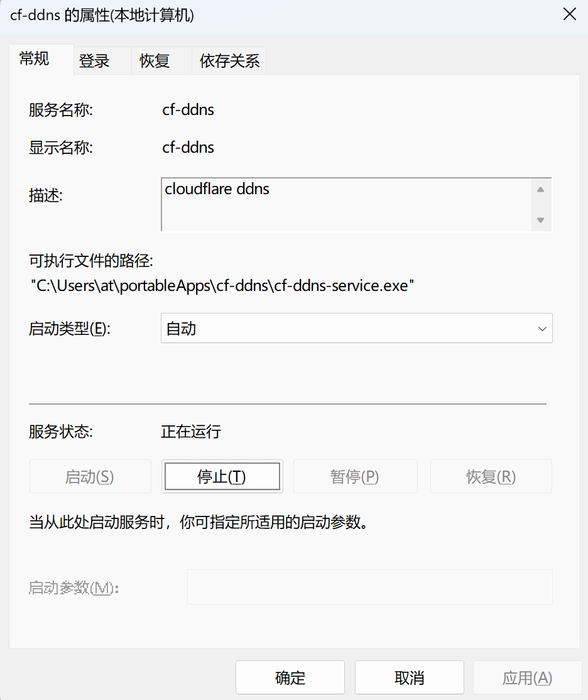

---
categories:
  - tools
title: "快速开始cloudflare ddns"
date: 2024-03-27T09:26:00+08:00
lastmod: 2024-04-10T13:00:00+08:00
draft: false
tags:
  - ddns
  - cloudflare
  - cloudflare-ddns
---

## 介绍

本文讲述如何用最简单的方式快速开始使用cloudflare ddns。

## 准备操作

### 1. 注册cloudflare账号

本文不会详细将这个，请参考其他教程。

### 2. 获取cloudflare的api key

1. 访问https://dash.cloudflare.com/profile/api-tokens，右上角处可以切换为简体中文
2. 点击创建令牌，选择编辑区域DNS模板
3. 名称任意填写
4. 令牌权限选择编辑区域DNS，令牌的权限务必选择
    - 区域-区域-读取
    - 区域-dns-编辑
5. 区域资源，选择需要用于ddns的域名
6. 客户端IP（可选），这个用于区别调用客户端的白名单，由于本文讲解ddns，本身访问的公网IP就是动态的，所以这里最好不要填写
7. TTL，定义此令牌将保持活动状态的时间长度。这个不需要填写


完成后点击创建令牌，并拷贝token


### 3. 获取zone id

1. 访问https://dash.cloudflare.com/
2. 选择需要用于ddns的域名
3. 页面右下角即可看到zone id


## 快速开始

### Windows x64

#### 基础使用方式

1. 从[下载页](https://github.com/selcarpa/cloudflare-ddns/releases/latest)下载cf-ddns-windows-x64-(version)-RELEASE.exe，更名为cf-ddns.exe
2. 将cf-ddns.exe放到一个目录，例如C:\Users\[UserName]\cf-ddns，[UserName]替换为你的用户名
3. 进入到cf-ddns所在目录，打开终端，执行命令，这行命令将开始进行300秒一次的ip检查，一旦ip变化，将会更新cloudflare的域名解析
    ```shell
    cf-ddns.exe -gen -zoneId=<替换为上文的zoneId> -authKey=<替换为上文的token> -domain=<替换为想使用的域名> -v4=<true: 开启ipv4, false: 关闭ipv4> -v6=<true: 开启ipv6, false: 关闭ipv6>
    ```

#### 配合[winsw](https://github.com/winsw/winsw)，创建windows服务使用

上文的基础使用方式，需要一直保持终端开启，如果关机或者终端关闭，将无法继续更新域名解析。这里我们可以使用winsw将cf-ddns.exe包装成windows服务。
winsw是一个开源的windows服务包装器，可以将任意可执行文件包装成windows服务，官方文档请参考[这里](https://github.com/winsw/winsw#get-started)。

1. 从[下载页](https://github.com/selcarpa/cloudflare-ddns/releases/latest)下载cf-ddns-windows-x64-(version)-RELEASE.exe，更名为cf-ddns.exe
2. 将cf-ddns.exe放到一个目录，例如C:\Users\[UserName]\cf-ddns，[UserName]替换为你的用户名，注意后续的内容中，这个目录将会多次出现
3. 从[winsw](https://github.com/winsw/winsw/releases/tag/v2.12.0)下载[winsw-2.12.0-bin.exe](https://github.com/winsw/winsw/releases/download/v2.12.0/WinSW-x64.exe)
4. 在cf-ddns所在目录，创建一个xml文件，例如cf-ddns-service.xml
    ```xml
    <service>
        <id>cf-ddns</id>
        <name>cf-ddns</name>
        <description>cloudflare ddns</description>
        <workingdirectory>C:\Users\[UserName]\cf-ddns</workingdirectory>
        <executable>C:\Users\[UserName]\cf-ddns</executable>
        <startarguments>-gen -zoneId=<替换为上文的zoneId> -authKey=<替换为上文的token> -domain=<替换为想使用的域名> -v4=<true: 开启ipv4, false: 关闭ipv4> -v6=<true: 开启ipv6, false: 关闭ipv6></startarguments>
        <onfailure action="restart" delay="10 sec"/>
    </service>
    ```
5. 将WinSW-x64.exe重命名为cf-ddns-service.exe，完成后的目录结构如下
    ```shell
    C:\Users\[UserName]\cf-ddns
    ├── cf-ddns.exe
    ├── cf-ddns-service.xml
    ├── cf-ddns-service.exe
    ```
6. 打开终端，执行命令，安装服务
    ```shell
    cf-ddns-service.exe install cf-ddns-service.xml
    ```
7. 启动服务
    ```shell
    cf-ddns-service.exe start cf-ddns-service.xml
    ```
8. 查看服务状态
    ```shell
    cf-ddns-service.exe status cf-ddns-service.xml
    ```
9. 卸载服务
    ```shell
    cf-ddns-service.exe uninstall cf-ddns-service.xml
    ```

完成后，cf-ddns将会以windows服务的方式运行，即使关机或者终端关闭，也会继续更新域名解析。
在Windows的服务管理器中，可以看到cf-ddns服务。



### Linux x64

#### 基础使用方式

1. 从[下载页](https://github.com/selcarpa/cloudflare-ddns/releases/latest)下载cf-ddns-linux-x64-(version)-RELEASE.kexe
2. 将下载的文件重命名为cf-ddns，并且给予运行权限
    ```shell
        mv cf-ddns-linux-x64-(version)-RELEASE.kexe cf-ddns && chmod +x cf-ddns
     ```
3. 将cf-ddns.kexe放到一个目录，例如/usr/local/bin
    ```shell
    mv cf-ddns /usr/local/bin
    ```
4. 执行命令，这行命令将开始进行300秒一次的ip检查，一旦ip变化，将会更新cloudflare的域名解析
    ```shell
    cf-ddns.kexe -gen -zoneId=<替换为上文的zoneId> -authKey=<替换为上文的token> -domain=<替换为想使用的域名> -v4=<true: 开启ipv4, false: 关闭ipv4> -v6=<true: 开启ipv6, false: 关闭ipv6>
    ```

#### 配合systemd使用

1. 从[下载页](https://github.com/selcarpa/cloudflare-ddns/releases/latest)下载cf-ddns-linux-x64-(version)-RELEASE.kexe
2. 将下载的文件重命名为cf-ddns，并且给予运行权限
    ```shell
        mv cf-ddns-linux-x64-(version)-RELEASE.kexe cf-ddns && chmod +x cf-ddns
     ```
3. 将cf-ddns.kexe放到一个目录，例如/usr/local/bin
    ```shell
    mv cf-ddns /usr/local/bin
    ```
4. 创建服务
    1. 创建服务文件
       ```shell
        # 创建服务
        vim /etc/systemd/system/cloudflare-ddns.service
       ```
    2. 填充内容
       ```ini
       [Unit]
       Description=cloudflare-ddns
       After=network.target
       
       [Service]
       Type=simple
       ExecStart=/usr/bin/cf-ddns -gen -zoneId=<替换为上文的zoneId> -authKey=<替换为上文的token> -domain=<替换为想使用的域名> -v4=<true: 开启ipv4, false: 关闭ipv4> -v6=<true: 开启ipv6, false: 关闭ipv6>
       Restart=on-failure
       
       [Install]
       WantedBy=multi-user.target
       ```
    3. 启动服务
       ```shell
       systemctl start cloudflare-ddns
       ```
    4. 设置开机启动
       ```shell
       systemctl enable cloudflare-ddns
       ```
#### 配合cron使用

1. 从[下载页](https://github.com/selcarpa/cloudflare-ddns/releases/latest)下载cf-ddns-linux-x64-(version)-RELEASE.kexe
2. 将下载的文件重命名为cf-ddns，并且给予运行权限
    ```shell
        mv cf-ddns-linux-x64-(version)-RELEASE.kexe cf-ddns && chmod +x cf-ddns
     ```
3. 将cf-ddns.kexe放到一个目录，例如/usr/local/bin
    ```shell
    mv cf-ddns /usr/local/bin
    ```
4. 编辑cron
    ```shell
    crontab -e
    ```
5. 添加一行
    ```shell
    */5 * * * * /usr/local/bin/cf-ddns -gen -zoneId=<替换为上文的zoneId> -authKey=<替换为上文的token> -domain=<替换为想使用的域名> -v4=<true: 开启ipv4, false: 关闭ipv4> -v6=<true: 开启ipv6, false: 关闭ipv6> -once
    ```


#### docker方式

##### docker-cli

```shell
docker run -d \
    --network host \
    --name cf-ddns \
    --restart unless-stopped \
    selcarpa/cloudflare-ddns:latest \
    -gen -zoneId=<替换为上文的zoneId> -authKey=<替换为上文的token> -domain=<替换为想使用的域名> -v4=<true: 开启ipv4, false: 关闭ipv4> -v6=<true: 开启ipv6, false: 关闭ipv6>
```

##### docker-compose

```yaml
services:
  cf-ddns:
    image: selcarpa/cloudflare-ddns:latest
    network_mode: host
    container_name: cf-ddns
    restart: unless-stopped # 开机自启
    command:
      -gen -zoneId=<替换为上文的zoneId> -authKey=<替换为上文的token> -domain=<替换为想使用的域名> -v4=<true:开启ipv4, false: 关闭ipv4> -v6=<true: 开启ipv6, false: 关 闭ipv6>
```