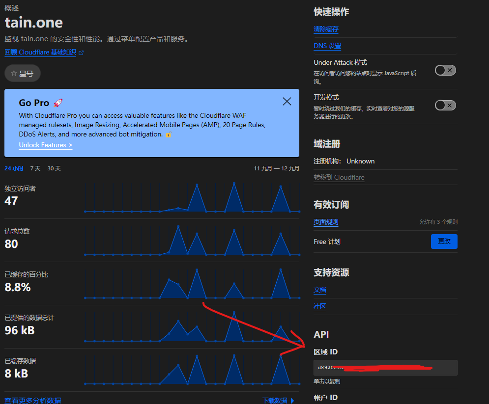

## [A quicker start is available here](../cf-ddns-super-quick-start)

## Introduction

When hosting private services at home without a public IP, external access is impossible. There are generally three solutions:

- Option 1: Call your ISP to assign a public IP
- Option 2: Use IPv6
- Option 3: Use NAT traversal

This article does not cover NAT traversal, so Option 3 is excluded.

Options 1 and 2 share a common problem: public IP changes. When your public IP changes, you can no longer access your services using the old IP. This is where dynamic DNS (DDNS) comes in—automatically updating DNS records when your IP changes.

## Prerequisites

### 1. Register a Cloudflare Account

This article won't cover registration in detail; please refer to other tutorials.

### 2. Get a Cloudflare API Token

1. Visit https://dash.cloudflare.com/profile/api-tokens
2. Click "Create Token" and select the "Edit zone DNS" template
3. Enter any name
4. Set token permissions to edit zone DNS:
   - Zone - Zone - Read
   - Zone - DNS - Edit
5. For Zone Resources, select the domain to use for DDNS
6. Client IP Filter (optional) — since DDNS inherently involves dynamic IPs, it's best to leave this blank
7. TTL — defines how long the token remains active; leave it empty


After creation, copy the token.


### 3. Get Your Zone ID

1. Visit https://dash.cloudflare.com/
2. Select the domain for DDNS
3. The Zone ID is visible in the bottom-right corner of the page



### 4. Configure the Client (JVM Version)

This article uses the [cloudflare-ddns](https://github.com/selcarpa/cloudflare-ddns) project as the DDNS client. It's built with Kotlin and currently provides a JAR version (native version in development).

#### Install Java

This project targets JDK 17, so install JDK 17 accordingly.

#### Download the JAR

Download the latest JAR from the [cloudflare-ddns releases page](https://github.com/selcarpa/cloudflare-ddns/releases) to any local directory.

#### Configuration

Create `config.json5` in the same directory as the JAR:

```json5
{
    "common": {
      "zoneId": "", // Your zone ID
      "authKey": "", // Your API token
      "v4": false, // Enable IPv4
      "v6": false, // Enable IPv6
      "ttl": 300  // TTL for cache and DNS check interval
    },
    "domains": [
      {
        "name": "cd1.tain.one", // Domain for DDNS
        "proxied": true // Enable Cloudflare proxy
      }
    ]
  }
```

#### Run the JAR

##### Direct Execution
```shell
java -jar cloudflare-ddns-0.0.1.jar -c=config.json5
```

Use nohup, tmux, or screen to run it in the background.

##### With systemd (untested)

```shell
vim /etc/systemd/system/cloudflare-ddns.service
```

```ini
[Unit]
Description=cloudflare-ddns
After=network.target

[Service]
Type=simple
ExecStart=/usr/bin/java -jar /opt/cloudflare-ddns-0.0.1.jar -c=/opt/config.json5
Restart=on-failure

[Install]
WantedBy=multi-user.target
```

```shell
systemctl start cloudflare-ddns
systemctl enable cloudflare-ddns
```

### 5. Configure the Client (Native Version)

The native version currently supports Linux x64 only; more platforms are planned.

(Under construction...)

> *This article is translated by deepseek-v4-flash (model: deepseek/deepseek-v4-flash).*
