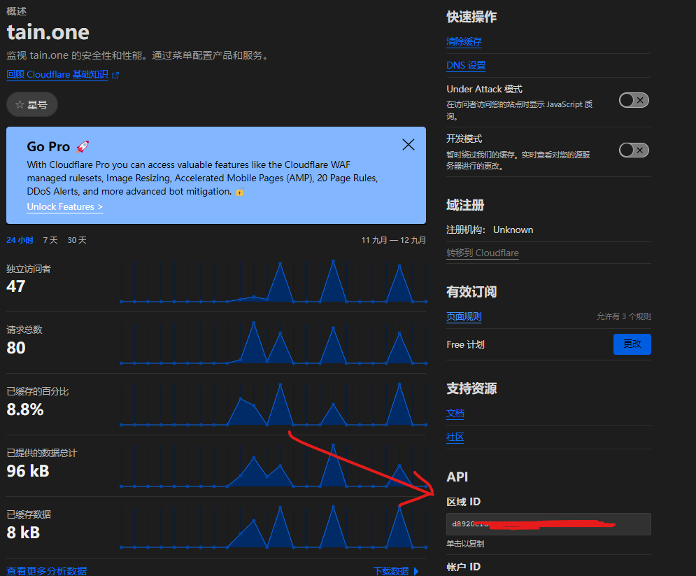

---
categories:
- tools
title: "使用cloudflare的api实现ddns"
date: 2023-09-11T17:18:08+08:00
lastmod: 2024-03-27T09:26:00+08:00
draft: false
tags:
- ddns
- cloudflare
- cloudflare-ddns
toc:
  enable: true
  sidebar: right
  keepStatic: false
---

## [极简开始方式已更新，请点击移步](../cf-ddns-super-quick-start)

## 介绍

在家里搭建一些私有服务时，如果没有公网ip，就无法通过外网访问。这个时候我们一般有三个方案：

- 方案一，打电话让运营商分配一个公网ip
- 方案二，使用ipv6
- 方案三，使用内网穿刺

本文不涉及内网穿刺服务。所以方案三在本文没有任何剩下的讨论内容。

方案一和方案二涉及一个问题，就是公网ip的变化。如果公网ip变化了，就无法通过原有的ip访问到服务。这个时候我们就需要动态的更新域名解析。这个过程就叫做ddns。

## 准备操作

### 1. 注册cloudflare账号

本文不会详细将这个，请参考其他教程。

### 2. 获取cloudflare的api key

1. 访问https://dash.cloudflare.com/profile/api-tokens，右上角处可以切换为简体中文
2. 点击创建令牌，选择编辑区域DNS模板
3. 名称任意填写
4. 令牌权限选择编辑区域DNS，令牌的权限务必选择
   - 区域-区域-读取
   - 区域-dns-编辑 
5. 区域资源，选择需要用于ddns的域名
6. 客户端IP（可选），这个用于区别调用客户端的白名单，由于本文讲解ddns，本身访问的公网IP就是动态的，所以这里最好不要填写
7. TTL，定义此令牌将保持活动状态的时间长度。这个不需要填写


完成后点击创建令牌，并拷贝token


### 3. 获取zone id

1. 访问https://dash.cloudflare.com/
2. 选择需要用于ddns的域名
3. 页面右下角即可看到zone id



### 4. 配置客户端（JVM版本）

本文当前版本采用[cloudflare-ddns](https://github.com/selcarpa/cloudflare-ddns)项目作为ddns客户端，项目基于kotlin开发，当前仅提供jar版本，后续会提供native版本。

#### Java安装

本项目采用jdk17作为目标环境，所以需要安装jdk17，此处不会详细介绍。

#### 下载jar包

访问[cloudflare-ddns的release页面](https://github.com/selcarpa/cloudflare-ddns/releases)下载最新的jar包到本地任意位置

#### 配置文件

在jar包同级目录下创建`config.json5`文件，内容如下：

```json5
{
    "common": {
      "zoneId": "",//填入上面的zone id
      "authKey": "",//填入上面的token
      "v4": false,//是否更新ipv4
      "v6": false,//是否更新ipv6
      "ttl": 300//ttl，同时用于缓存时间和dns记录检测的间隔
    },
    "domains": [
      {
        "name": "cd1.tain.one",//用于ddns的域名
        "proxied": true//是否开启cloudflare的代理
      }
    ]
  }
```

#### 运行jar包

##### 直接运行
```shell
java -jar cloudflare-ddns-0.0.1.jar -c=config.json5
```
直接运行的方式可以使用nohup/tmux/screen等方式后台运行

##### 也可配合systemd使用（尚未验证）

```shell
#创建服务
vim /etc/systemd/system/cloudflare-ddns.service
```

```ini
[Unit]
Description=cloudflare-ddns
After=network.target

[Service]
Type=simple
ExecStart=/usr/bin/java -jar /opt/cloudflare-ddns-0.0.1.jar -c=/opt/config.json5
Restart=on-failure

[Install]
WantedBy=multi-user.target
```

```shell
#启动服务
systemctl start cloudflare-ddns
#设置开机启动
systemctl enable cloudflare-ddns
```

#### 4. 配置客户端（原生版本）

当前原生版本仅支持linux x64，后续会提供更多平台的支持。

（建设中...