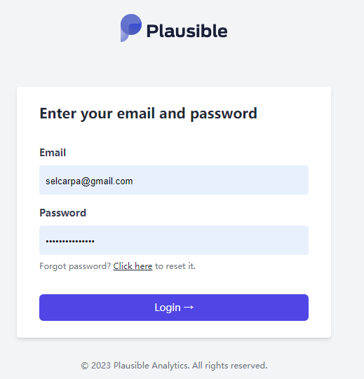
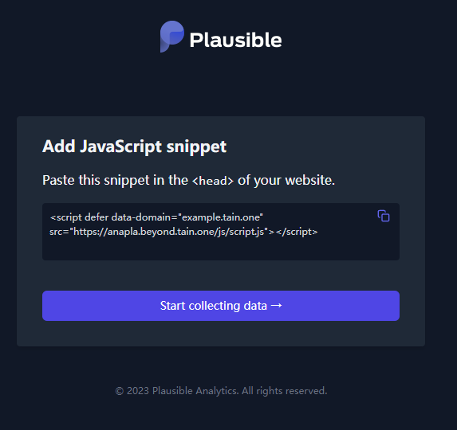
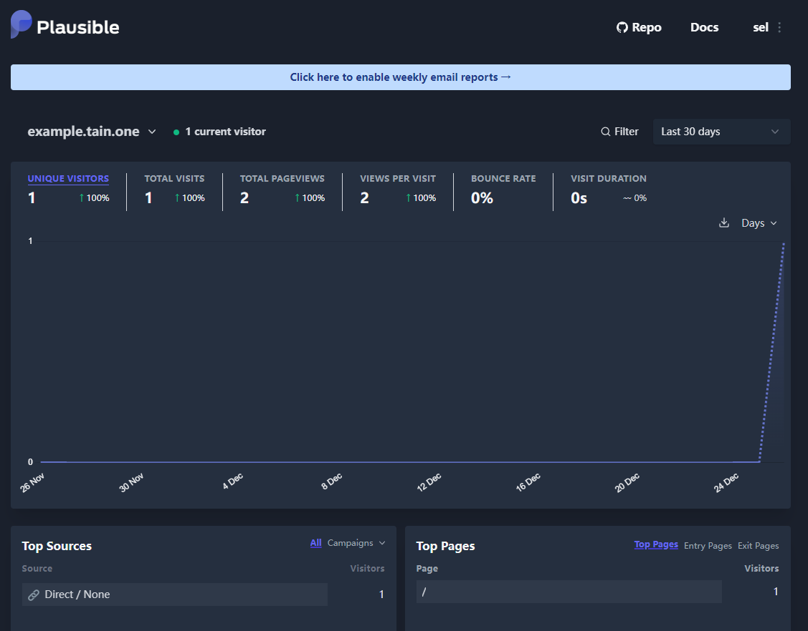

## Background

- We need an analytics tool to track static website visits.
- Many users install uBlock, AdBlock, etc., causing many analytics services to miss traffic.

## Plausible

[Plausible](https://plausible.io/) is an open-source analytics tool for tracking static website visits. Its highlights:

- Open source under AGPLv3
- No cookies, no user tracking, no personal data collection
- Small script size, does not affect page load speed
- Supports public statistics
- Supports email subscription for stats

This article uses docker-compose to deploy Plausible with the official Docker image, excluding email-related components.

## Requirements

- docker-compose: see [official docs](https://docs.docker.com/compose/install/)

## Deployment Guide

```shell
git clone https://github.com/plausible/hosting
cd hosting
vim docker-compose.yml
```

### Configuration

```yml
version: "3.3"
services:
  # mail:
  #   image: bytemark/smtp
  #   restart: always

  plausible_db:
    image: postgres:14-alpine
    restart: always
    volumes:
      - db-data:/var/lib/postgresql/data
    environment:
      - POSTGRES_PASSWORD=postgres

  plausible_events_db:
    image: clickhouse/clickhouse-server:23.3.7.5-alpine
    restart: always
    volumes:
      - event-data:/var/lib/clickhouse
      - ./clickhouse/clickhouse-config.xml:/etc/clickhouse-server/config.d/logging.xml:ro
      - ./clickhouse/clickhouse-user-config.xml:/etc/clickhouse-server/users.d/logging.xml:ro
    ulimits:
      nofile:
        soft: 262144
        hard: 262144

  plausible:
    image: plausible/analytics:v2.0
    restart: always
    command: sh -c "sleep 10 && /entrypoint.sh db createdb && /entrypoint.sh db migrate && /entrypoint.sh run"
    depends_on:
      - plausible_db
      - plausible_events_db
    ports:
      - 8000:8000
    env_file:
      - plausible-conf.env

volumes:
  db-data:
    driver: local
  event-data:
    driver: local
```

Run `docker-compose up -d` to start. Visit `http://localhost:8000` to see the Plausible interface.

Register an account.



Add a new site.


Copy the site JS snippet.



Add the JS snippet to your static pages to start tracking visits.



> *This article is translated by deepseek-v4-flash (model: deepseek/deepseek-v4-flash).*
