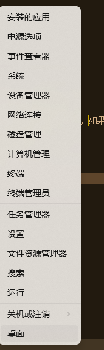

---
categories:
  - tools
title: "通关ipv6设置windows远程桌面"
date: 2024-07-09T11:00:00+08:00
draft: false
tags:
  - ddns
  - cloudflare
  - cloudflare-ddns
  - remote-desktop
---

== 介绍

在家里有一台windows电脑，想要远程桌面连接，但是家里的网络是ipv6，ipv4是没有公网ip的，所以需要通过ipv6来连接，但是windows远程桌面默认是ipv4的，所以需要设置一下。

== 准备条件

1. 一台windows电脑
2. 一个域名
3. 一个cloudflare账号
4. 支持ipv6的网络

== 检查项目

1. 检查是否支持ipv6
  a. 打开浏览器
  b. 访问 https://test-ipv6.com/[ipv6测试网站^]
  c. 检查是否支持ipv6，显示如下图所示时，支持ipv6，如果提示不支持ipv6，剩下的步骤就不用做了，联系网络运营商解决ipv6问题。
2. 检查是否开启Windows远程桌面
  a. 右键点击“此电脑”，选择“系统” 
  b. 查看系统是否是专业版，Windows11专业版包含：专业版、工作站专业版、企业版、教育版、专业教育版，这部分版本可以直接使用Windows的rdp支持进行远程桌面。如果属于这些版本，需要升级到专业版，或者使用RDP Wrapper来实现远程桌面， 
  c. 开启远程桌面，点击下面相关内容的“远程桌面”，勾选“远程桌面”，并勾选“要求使用网络级别身份验证” 
  d. 到目前为止，远程桌面已经开启，已经可以在局域网内使用ipv4进行远程桌面连接，但是我们需要使用ipv6进行远程桌面连接，所以需要继续下面的步骤。

== 设置cloudflare ddns

参考文章  link:../cf-ddns-super-quick-start[快速开始cloudflare ddns]

== 测试远程桌面连接

1. 打开目标主机
2. 在不同的网络中打开客户端（Windows远程桌面、Android RD客户端都行）
3. 在客户端中输入Cloudflare域名，点击连接
4. 输入用户名和密码，点击连接
5. 连接成功
