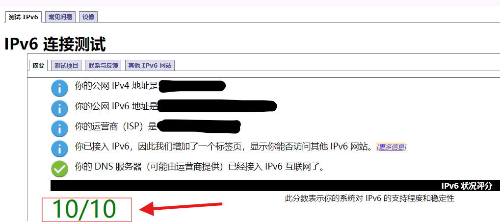
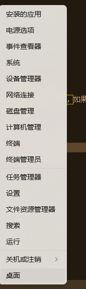
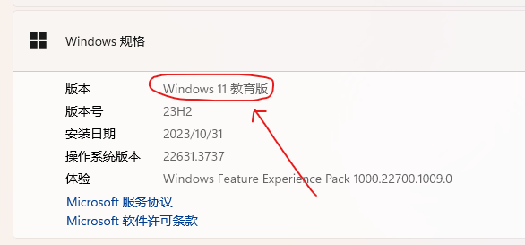
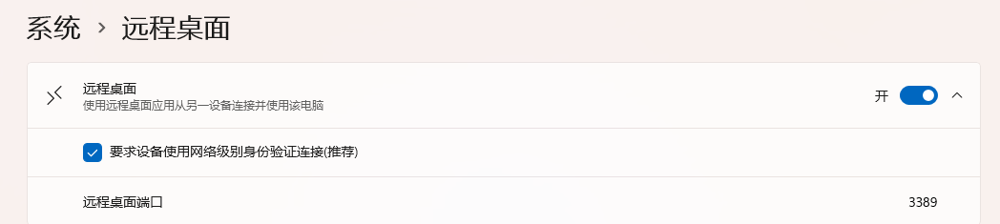

---
categories:
  - tools
title: "Setting Up Windows Remote Desktop over IPv6"
date: 2024-07-09T11:00:00+08:00
draft: false
tags:
  - ddns
  - cloudflare
  - cloudflare-ddns
  - remote-desktop
toc:
  enable: true
  keepStatic: false
---

== Introduction

I have a Windows PC at home that I want to access via Remote Desktop. The home network uses IPv6—there's no public IPv4 address—so the connection must go through IPv6. However, Windows Remote Desktop defaults to IPv4, so some configuration is needed.

== Prerequisites

1. A Windows PC
2. A domain name
3. A Cloudflare account
4. An IPv6-capable network

== Pre-checks

1. Check IPv6 support
  a. Open a browser
  b. Visit https://test-ipv6.com/[IPv6 test site^]
  c. If the page shows IPv6 support (as shown below), you're good. If not, contact your ISP. 
2. Check if Windows Remote Desktop is enabled
  a. Right-click "This PC" and select "System" 
  b. Verify your Windows edition is Pro. Windows 11 Pro editions include: Pro, Workstation Pro, Enterprise, Education, Pro Education. These support RDP natively. If you have a different edition, upgrade to Pro or use RDP Wrapper. 
  c. Enable Remote Desktop: click "Remote Desktop" in the related settings, toggle it on, and check "Require devices to use Network Level Authentication" 
  d. Remote Desktop is now enabled for LAN access via IPv4. To use IPv6, continue with the steps below.

== Set Up Cloudflare DDNS

See the guide: link:../cf-ddns-super-quick-start[Quick Start Cloudflare DDNS]

== Test Remote Desktop Connection

1. Power on the target host
2. Open the Remote Desktop client on a different network (Windows Remote Desktop, Android RD Client, etc.)
3. Enter the Cloudflare domain name and click Connect
4. Enter your username and password and click Connect
5. Connection established

> *This article is translated by deepseek-v4-flash (model: deepseek/deepseek-v4-flash).*
