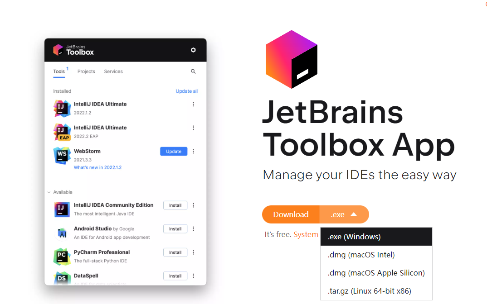
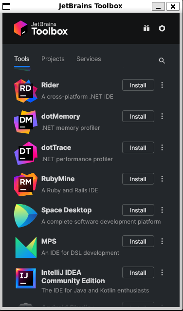

## Motivation

Most Java programmers use IntelliJ IDEA on Windows for development and deploy to Linux servers. In most cases, Java's strong cross-platform nature makes this work fine. However, there are times when platform-specific APIs cause cross-platform headaches—for example, Selenium development requires native browser components that need specific runtime environment configuration, and environment differences can lead to extra debugging effort.

## Requirements

- Windows 11
- WSL2
- Ubuntu 22.04

## Install WSLg Runtime

Follow [Microsoft's official guide](https://github.com/microsoft/wslg) to set up the WSLg environment.

## Update Package Sources

```bash
sudo apt update
sudo apt upgrade -y
```

### Install Dependencies

After updating, you still cannot launch GUI applications directly. You need to install XWayland-related dependencies. Following the guide, simply install vlc:

```bash
sudo apt install vlc -y
```

## Download Toolbox for Linux and Extract

Download the Linux version from the [download page](https://www.jetbrains.com/toolbox-app/) and extract it.



```bash
wget https://download.jetbrains.com/toolbox/jetbrains-toolbox-2.1.0.18144.tar.gz
tar -zxvf jetbrains-toolbox-2.1.0.18144.tar.gz
```

## Install AppImage Runtime

[Reference](https://github.com/AppImage/AppImageKit/wiki/FUSE)

```bash
# Ubuntu 22.04 installation
sudo add-apt-repository universe
sudo apt install libfuse2
```

## Run Toolbox

```bash
./jetbrains-toolbox-2.1.0.18144/jetbrains-toolbox
```



## Install IDEA

Click IntelliJ IDEA Community, then click Install.

> Other JetBrains IDEs can also be installed this way.

> *This article is translated by deepseek-v4-flash (model: deepseek/deepseek-v4-flash).*
