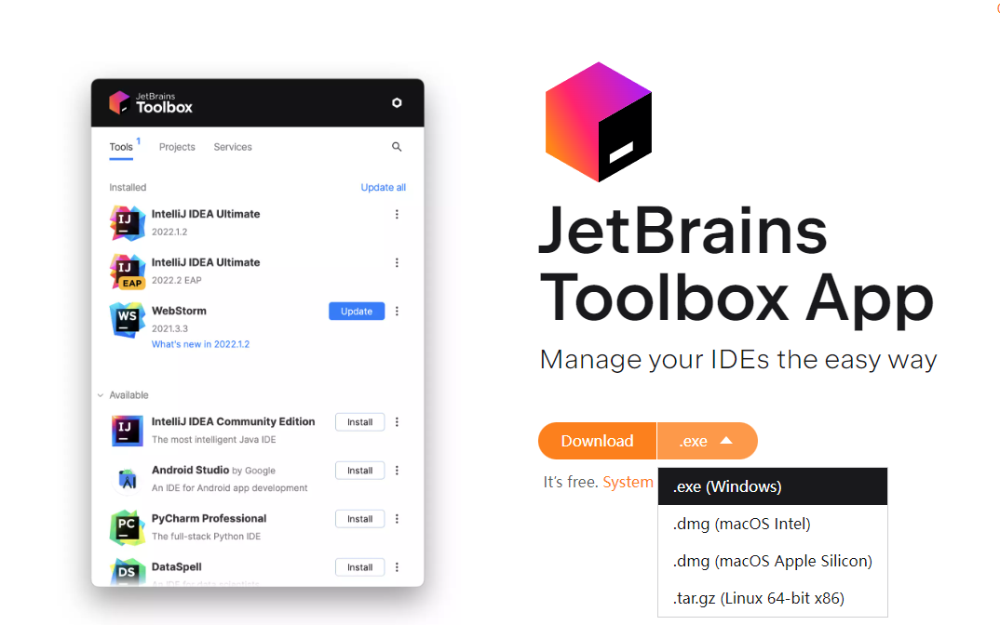
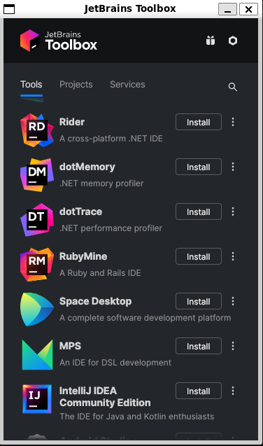

---
categories:
- tools
title: "借助wslg使用Linux版本的idea"
date: 2023-08-29T23:56:17+08:00
draft: false
tags:
- wsl
- wslg
- Jetbrains
---

## 缘由

大部分Java程序员都会使用idea在Windows下进行开发，然后部署到Linux服务器上，大部分情况下，Java强大的跨平台性使得这种方式没有问题。但是！在某些时候，开发使用到的平台api会出现一些问题，导致跨平台很麻烦，比如selenium相关开发，需要用到selenium组件，此组件需要配置一些运行环境，为了避免运行环境差异导致的额外调试。

## 环境要求

- Windows 11
- WSL2
- Ubuntu 22.04

## 安装wslg运行环境

按照[微软官方的教程](https://github.com/microsoft/wslg)，我们需要安装wslg的环境

## 首先更新软件源

```bash
sudo apt update
sudo apt upgrade -y
```

### 安装依赖

更新完成软件源后，我们仍然不能直接启动图形软件，需要安装XWayland相关的依赖，按照教程，我们直接安装一个vlc即可

```bash
sudo apt install vlc -y
```


## 下载toolbox Linux并解压


在[下载页面](https://www.jetbrains.com/toolbox-app/)选择Linux版本下载，下载完成后解压



```bash
wget https://download.jetbrains.com/toolbox/jetbrains-toolbox-2.1.0.18144.tar.gz
tar -zxvf jetbrains-toolbox-2.1.0.18144.tar.gz
```

## 安装AppImage运行环境

[参考](https://github.com/AppImage/AppImageKit/wiki/FUSE)

```bash
#ubuntu22.04安装方式
sudo add-apt-repository universe
sudo apt install libfuse2
```

## 运行toolbox

```bash
./jetbrains-toolbox-2.1.0.18144/jetbrains-toolbox
```



## 安装idea

点击intellij idea community，然后点击install即可

>另外，其他一些Jetbrains的IDE也可以使用这种方式安装